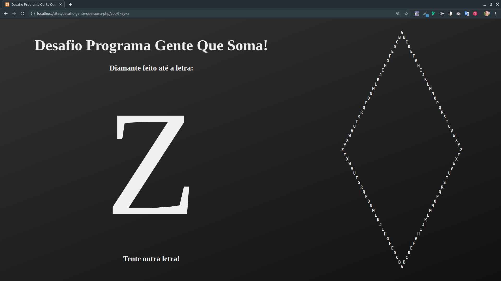

# Desafio Dev Ramper

O desafio tem como objetivo analisar a lógica utilizada na resolução do problema. A forma de organização e representação das informações ficam a cargo do participante, entretanto é necessário criar uma interface para que o usuário interaja com o desafio. Vale ressaltar que não serão permitidas cópias retiradas da internet, que consequentemente acarretará na desclassificação do candidato.

Abaixo são listadas as linguagens permitidas para este desafio:

- C#
- Java
- PHP

## O Problema

### Diamantes

Dado uma letra ('A' a 'Z'), exiba um diamante iniciando em 'A' e tendo a letra fornecida com o ponto mais distante.

Por exemplo, dado a letra 'E' temos:

```text
    A
   B B
  C   C
 D     D
E       E
 D     D
  C   C
   B B
    A
```

Dado a letra 'C' temos:

```text
  A
 B B
C   C
 B B
  A
```

### Incremento

Também é necessário criar um incremento adicional ao desafio, podendo ser qualquer funcionalidade que agregue na experiência do usuário.

Desafio retirado do site.
<http://dojopuzzles.com/problemas/exibe/diamantes/>

---

## A Resolução

Foi utilizada a linguagem PHP para criar o algorítmo que desenha o diamante

Chama a função que desenha o diamante:

```php
function drawDiamont ($letter) {
  echo strtoupper($letter) == 'A'
    ? 'A'
    : drawRecDiamont("\n", strtoupper($letter), 'A', ord(strtoupper($letter))-ord('A'), -1, true);
}
```

Função que desenha o diamante recursivamente:

```php
function drawRecDiamont($diamont, $letter, $currentLetter, $leftSpace, $innerSpace, $topSide) {
  if($innerSpace > 0) {
    $diamont .= str_repeat(" ", $leftSpace) . $currentLetter . str_repeat(" ", $innerSpace) . $currentLetter . "\n";
  } else {
    $diamont .= str_repeat(" ", $leftSpace) . $currentLetter . "\n";
  }
  if ($topSide) {
    if ($letter != $currentLetter) {
      return drawRecDiamont($diamont, $letter, chr(ord($currentLetter)+1), $leftSpace - 1, $innerSpace + 2, true);
    } else {
      return drawRecDiamont($diamont, $letter, chr(ord($currentLetter)-1), $leftSpace + 1, $innerSpace - 2, false);
    }
  } else {
    if ($currentLetter != 'A') {
      return drawRecDiamont($diamont, $letter, chr(ord($currentLetter)-1), $leftSpace + 1, $innerSpace - 2, false);
    } else {
      return $diamont;
    }
  }
}
```

Para fazer a funcionalidade que agrega na experiência do usuário utilizei HTML, CSS e JavaScript, criando uma interface que aguarda o usuário clicar em qualquer letra em seu teclado para desenhar um novo diamante.

Ao entrar:


Clicando na tecla "C":


Clicando na tecla "H":


Clicando na tecla "Z":


